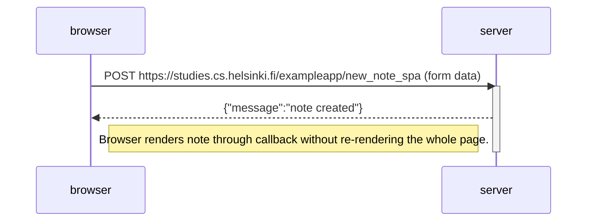

```mermaid
sequenceDiagram
    participant browser
    participant server

    browser->>server: POST https://studies.cs.helsinki.fi/exampleapp/new_note_spa (form data)
    activate server
    server-->>browser: {"message":"note created"}
    Note right of browser: Browser renders note through callback without re-rendering the whole page.

    deactivate server
```

    